<div align="center">

# Hardpull

### A confidential exposure registry for onchain credit.

**Undercollateralized lenders detect loan stacking — without any lender ever seeing another lender's book.**

[](./docs/deployments.md)
[](https://hashscan.io/testnet/topic/0.0.10525131)
[](./docs/partners/chainlink-integration.md)
[](./docs/partners/the-graph-integration.md)
[](./contracts)
[](./LICENSE)

```http
POST /v1/pull  →  { verdict, exposureBucket, inquiryVelocity, stackingFlag }
```

<sub>Built for **ETHOnline 2026** · Start Fresh / Net-New track</sub>

[**Architecture**](./docs/architecture.md) · [**Spec**](./docs/spec.md) · [**Deployments**](./docs/deployments.md) · [**Decisions**](./docs/DECISIONS.md) · [**Partners**](./docs/partners)

</div>

---

## The problem

A borrower draws $50,000 from one lender. Twelve minutes later, $50,000 more from a second lender
on a different protocol. Then a third. Each lender underwrote someone who looked unencumbered.
All three are now holding the same collateral-free risk, and none of them will find out until
something defaults.

Five things make this unfixable with the tools that exist today:

| | |
|---|---|
| **Stacking is undetectable** | Simultaneous originations land within minutes. Every lender sees a clean borrower. |
| **Private credit is invisible** | Maple's curated pools, Wildcat, OTC desks, prop-desk borrowing — none of it touches a public chain. Public-data scoring models cannot see any of it. |
| **Lenders will not share books** | Loan book data reveals customer lists, pricing and concentration. No competitor hands that over. This is why no shared registry exists. |
| **There is no inquiry record** | Offchain, a borrower shopping eight lenders in a week is a distress signal. Onchain, that pattern is invisible to everyone. |
| **Defaulting costs one new wallet** | Without a personhood binding, address-based credit history is trivially discarded. |

The hard constraint is the third one. Any design that requires lenders to reveal their books is
dead on arrival, regardless of how good the analytics are.

## The solution

**The join happens inside a TEE, and only a verdict comes out.**

1. **Furnishers** contribute position records. Public protocols are ingested automatically via a
   normalized subgraph; private lenders submit encrypted records, and only commitments go onchain.
2. **A Chainlink CRE Confidential Workflow** aggregates a subject's exposure across every
   furnisher inside an enclave and emits nothing but a verdict.
3. **Pullers** receive an exposure bucket, an inquiry velocity and a stacking flag — never a
   counterparty name, an exact amount, or a term sheet.
4. **Reciprocity is enforced onchain.** Pull allowance scales with what you furnish; freeloaders
   are rate-limited and repriced.
5. **Inquiries are themselves a signal.** Pull velocity detects stacking *in progress*, before any
   loan closes — and works with zero furnished data, which is what solves cold start.

<div align="center">



</div>

> More flows: [furnishing](./docs/diagrams/02-furnishing-flow.svg) · [pull](./docs/diagrams/03-pull-flow.svg) · [consent](./docs/diagrams/04-consent-flow.svg)

---

## The verdict

A pull returns exactly this, and nothing more:

```jsonc
{
  "verdict":                "CRITICAL",              // CLEAR | WARNING | CRITICAL | INSUFFICIENT_DATA
  "exposureBucket":         "50k-250k",              // never an exact amount
  "originationVelocity48h": 2,
  "inquiryVelocity7d":      5,
  "distinctFurnishers":     3,                       // a count, never a name
  "stackingFlags":          ["MULTI_ORIGINATION_48H"],
  "computedAt":             "2026-09-14T10:32:00Z",
  "attestation":            "0x…"                    // CRE-signed, verifiable onchain
}
```

### Stacking rules are deterministic, not ML

A lender must be able to see *why* a verdict fired. Thresholds are governable parameters, not
hardcoded constants.

| Verdict | Condition |
|:--|:--|
| 🔴 `CRITICAL` | ≥2 originations in 48h from distinct furnishers, **or** `proposedPrincipal + totalOutstanding > 3×` historical max single exposure |
| 🟡 `WARNING` | ≥4 inquiries in 7d from distinct pullers, **or** ≥1 origination in 48h, **or** any `DEFAULTED` record in 24 months |
| 🟢 `CLEAR` | Records exist and no above condition is met |
| ⚪ `INSUFFICIENT_DATA` | No furnished records, no public positions, no prior inquiries |

### Disclosure limits are hard invariants

The verdict must **never** contain:

- ❌ The identity of any furnisher holding a position
- ❌ An exact outstanding amount
- ❌ Loan terms, rate, maturity or collateral
- ❌ The identity of any prior puller

> Violating any of these destroys the product's reason to exist.
> **Enforced with tests, not discipline** — including a 10,000-run fuzz test on the disclosure invariant.

---

## Repo layout

A monorepo — every component is a workspace package rather than a separate repo.

| Path | Component | Stack |
|:--|:--|:--|
| [`contracts/`](./contracts) | Core protocol on Ethereum Sepolia | Solidity 0.8.24, Foundry, OpenZeppelin |
| [`cre/`](./cre) | Chainlink CRE Confidential Workflow | Go, CRE Workflow SDK, WASM |
| [`api/`](./api) | Bureau API — the product surface | TypeScript, Hono, Postgres, Redis, Zod |
| [`subgraph/`](./subgraph) | Normalized cross-protocol credit schema | The Graph, AssemblyScript |
| [`mcp/`](./mcp) | Subgraph MCP server + SKILL | TypeScript, MCP SDK |
| [`console/`](./console) | Lender console + borrower file viewer | Next.js 15, wagmi, viem, Tailwind |
| [`demo-lenders/`](./demo-lenders) | Two mock lender apps for the demo | Next.js |
| [`sdk-node/`](./sdk-node) | Typed client SDK | TypeScript, generated from `api/openapi.yaml` |
| [`packages/types/`](./packages/types) | Shared types + Zod schemas | TypeScript |
| [`docs/`](./docs) | Spec, architecture, plan, decisions | Markdown |

---

## Getting started

**Requires** Docker · Go 1.25+ · Foundry · Node 20+

```bash
pnpm install
./scripts/dev-stack.sh up     # Postgres, Redis, Anvil + contracts, CRE gateway, API
```

Then run the success criteria as an executable gate:

```bash
cd api && pnpm exec tsx src/scripts/e2e-scenario.ts --runs 3
```

> [!WARNING]
> `dev-stack.sh` is a **local rehearsal** stack. Payments are skipped
> (`HARDPULL_X402_MODE=disabled`) and compute runs against `cre/cmd/localgateway`, which executes
> the same handler code but **is not a TEE**. `GET /health/ready` always reports which of those
> are in effect. Neither may be used for a demo recording or a deployment.

Each package's own README documents how to run and build it individually;
see [`CONTRIBUTING.md`](./CONTRIBUTING.md) for commit conventions.

---

## Status

> [!NOTE]
> **Live on Ethereum Sepolia and Hedera Testnet.**

The full product narrative — [`docs/spec.md`](./docs/spec.md) §8's success criteria — runs end to
end against those real networks, asserted step by step by `api/src/scripts/e2e-scenario.ts`:

```text
✓ Consent gate                 a pull with no grant is refused 403 before compute or payment
✓ Consent is not transferable  Lender A presenting Lender B's token is refused 403
✓ Verdict                      CRITICAL — 50k-250k, flags ["MULTI_ORIGINATION_48H"]
✓ Disclosure limits            verdict names no furnisher, no exact amount, no counterparty
✓ Idempotency                  replay returned the cached verdict and logged no second inquiry
✓ SDK pull                     @hardpull/sdk-node returned CRITICAL against the live API
✓ Revocation                   the next pull after revoking is refused 403
```

### Deployed contracts — Ethereum Sepolia

All five **verified on Etherscan**. 36 Foundry tests, including the 10,000-run fuzz test on the
disclosure invariant. `VerdictAttestations` holds real attestations written by live pulls, and
`verify()` returns true for them.

| Contract | Address |
|:--|:--|
| `SubjectRegistry` | [`0x0A6C7Bc825946c32984d3e265f6Fd5a34621ecaF`](https://sepolia.etherscan.io/address/0x0A6C7Bc825946c32984d3e265f6Fd5a34621ecaF) |
| `FurnisherRegistry` | [`0x687e6194530F60A0BFd03aDf014E9C8D723E88DE`](https://sepolia.etherscan.io/address/0x687e6194530F60A0BFd03aDf014E9C8D723E88DE) |
| `ExposureCommitments` | [`0xb85AbFF5DcA9f3006A97B2f787d3Ee80691B11dC`](https://sepolia.etherscan.io/address/0xb85AbFF5DcA9f3006A97B2f787d3Ee80691B11dC) |
| `ReciprocityLedger` | [`0x75D729Fdb1E2F73941d65cFc557052B5c8A8A81a`](https://sepolia.etherscan.io/address/0x75D729Fdb1E2F73941d65cFc557052B5c8A8A81a) |
| `VerdictAttestations` | [`0x6417C8F2145A91be3d3cD905Fb003aEb71148782`](https://sepolia.etherscan.io/address/0x6417C8F2145A91be3d3cD905Fb003aEb71148782) |

Deploy transactions and full explorer links: [`docs/deployments.md`](./docs/deployments.md).

### Partner integrations

<table>
<tr><td width="33%" valign="top">

**⛓️ Chainlink CRE**

The **T-014 viability gate is closed** — `cre workflow simulate` runs the real Confidential
Workflow and returns a signed `CRITICAL` verdict.

Ten tests exercise the actual TEE handler through the SDK's `testutils` runtime — including the
one that matters: plaintext, furnisher identity and both private keys appear in neither the
verdict nor any enclave log.

[Write-up →](./docs/partners/chainlink-integration.md)

</td><td width="33%" valign="top">

**♦️ Hedera**

Inquiries land on HCS topic [`0.0.10525131`](https://hashscan.io/testnet/topic/0.0.10525131),
carrying only hashed or enumerable fields.

A pull past the consent and standing gates returns a real x402 challenge on `hedera:testnet`
denominated in USDC. Pricing is differential by reciprocity standing, read live from
`ReciprocityLedger` onchain.

[Write-up →](./docs/partners/hedera-integration.md)

</td><td width="33%" valign="top">

**🔷 The Graph**

One normalized `CreditPosition` schema across **Aave v3**, **Morpho Blue** and **Maple** plus
Hardpull's own contracts.

Both manifests build to real WASM, with mainnet addresses confirmed by live contract calls and
start blocks found by binary-searching an archive node.

[Write-up →](./docs/partners/the-graph-integration.md)

</td></tr>
</table>

### Everything else

- **`api/`** — 43 tests. `GET /health/ready` reports exactly which integrations are live and what
  each gate of `/v1/pull` will currently do.
- **`console/`, `demo-lenders/`, `mcp/`, `sdk-node/`** — all build in CI; the SDK performs a real
  pull against the live API as part of the gate.

### Not yet live

CRE **deploy** access (Confidential Workflows is private beta — simulation needed none of it), a
Subgraph Studio deployment, and World ID, which is deliberately unconfigured because it sits in
the "built but not submitted" bucket rather than among the three selected partners.

Two switches exist so the flow can be rehearsed without those:

| Switch | Effect | Safety |
|:--|:--|:--|
| `cre/cmd/localgateway` | Same handler code over HTTP | **Not a TEE** — says so on startup |
| `HARDPULL_X402_MODE=disabled` | Skips payment | Warns on every request; reported as `BYPASSED` by `/health/ready` |

Neither is on by default, and **no demo may run with them on**.

---

## What we don't claim

Hardpull is a hackathon build with real deployments, not a production credit bureau. Three things
we want to be direct about:

- **The TEE is simulated, not deployed.** CRE Confidential Workflows is in private beta; we ran
  the real workflow through `cre workflow simulate`, which exercises the same handler code but
  does not prove enclave attestation in production.
- **World ID proves personhood, not institutional identity**, so entity-level sybil resistance is
  out of scope for v1.
- **Exposure buckets leak coarse information deliberately.** Full opacity would make the registry
  useless for its own purpose; the design spends a bounded amount of information on purpose, and
  [`docs/spec.md`](./docs/spec.md) §6.6 defines exactly how much.

See [`docs/DECISIONS.md`](./docs/DECISIONS.md) for the full log — including the three bugs that
only surfaced once this ran against real infrastructure.

---

<div align="center">
<sub>MIT licensed · Built for ETHOnline 2026</sub>
</div>
