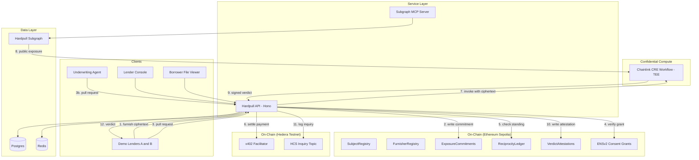
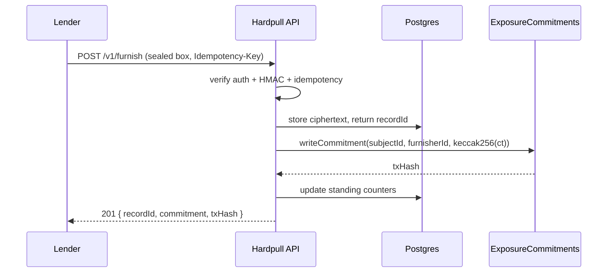
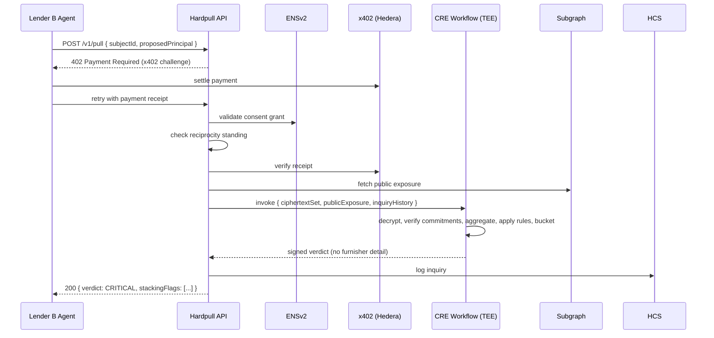
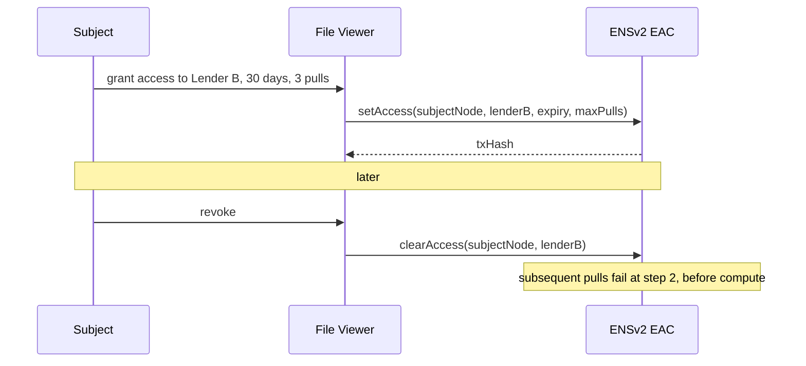

# Hardpull: System Architecture

## 1. High-Level Architecture

Four layers: **On-Chain Protocol**, **Confidential Compute**, **Service Layer**, **Client Interfaces**.



---

## 2. Component Details

### 2.1 Smart Contracts (Solidity 0.8.24, Foundry)

| Contract | Responsibility |
|---|---|
| `SubjectRegistry` | Maps `worldIdNullifierHash → subjectId`; binds wallets to subjects. Rejects rebinding. |
| `FurnisherRegistry` | Registers lenders, stores their ENS subname and public key, manages active/suspended state. |
| `ExposureCommitments` | Append-only `(subjectId, furnisherId, commitment, version, timestamp)`. Never plaintext. |
| `ReciprocityLedger` | Tracks fresh furnished-record counts per furnisher; computes `pullAllowance`; decays stale contributions. |
| `VerdictAttestations` | Stores the signed verdict hash, CRE attestation, and inquiry ID. Publicly re-verifiable. |

**Design constraint:** contracts are deliberately thin. They hold commitments, standing, and
attestations. All computation lives in the TEE; all plaintext lives in encrypted blobs off-chain.

### 2.2 Chainlink CRE Confidential Workflow (Go)

The only component that ever sees plaintext positions.

```
INPUT
  subjectId
  proposedPrincipal, currency
  ciphertextSet[]        (encrypted furnished records for this subject)
  publicExposure[]       (from subgraph, already public — no encryption)
  inquiryHistory[]       (from HCS / Postgres mirror)
  thresholds             (governable parameters)

STEPS
  1. Decrypt ciphertextSet with workflow private key
  2. Verify each record's commitment matches ExposureCommitments on-chain
  3. Aggregate totalOutstanding across private + public records
  4. Compute originationVelocity48h, inquiryVelocity7d, distinctFurnishers
  5. Apply stacking rules (spec.md §6.5)
  6. Bucket exposure; discard all per-lender detail
  7. Sign the verdict payload

OUTPUT
  verdict, exposureBucket, velocities, stackingFlags, attestation
```

**Invariant:** the output struct is a fixed shape with no furnisher-identifying fields. This is
enforced at the type level in Go, not by convention.

### 2.3 The Service Layer (`hardpull-api`)

Stateless Hono service. Never decrypts anything — it moves ciphertext.

Middleware chain, in order:
```
request-id → OAuth2 bearer validation → HMAC signature verification
→ IP allowlist → idempotency check → rate limit → route handler
```

Pull handler short-circuit order (fail fast, before paying for compute):
```
1. Idempotency hit?           → return cached response
2. Valid consent grant?       → else 403 CONSENT_MISSING
3. Sufficient standing?       → else 402 RECIPROCITY_INSUFFICIENT
4. Valid x402 receipt?        → else 402 PAYMENT_REQUIRED
5. Invoke CRE
6. Persist + attest + log
```

### 2.4 Subgraph (`hardpull-subgraph`)

The normalized schema is the contribution. One shape across three heterogeneous lending protocols.

```graphql
type CreditPosition @entity {
  id: ID!
  subject: Subject!
  protocol: Protocol!          # AAVE_V3 | MORPHO_BLUE | MAPLE | HARDPULL_FURNISHED
  principal: BigInt!
  currency: Bytes!
  collateralValue: BigInt      # null for uncollateralized
  originatedAt: BigInt!
  maturityAt: BigInt
  status: PositionStatus!      # ACTIVE | REPAID | DEFAULTED | LIQUIDATED | CLOSED
  isPublic: Boolean!
}

type Subject @entity {
  id: ID!                      # subjectId
  wallets: [Bytes!]!
  positions: [CreditPosition!]! @derivedFrom(field: "subject")
  inquiries: [Inquiry!]! @derivedFrom(field: "subject")
  firstSeenAt: BigInt!
}

type Inquiry @entity {
  id: ID!
  subject: Subject!
  pullerHash: Bytes!           # hashed — puller identity is never exposed
  verdict: String!
  occurredAt: BigInt!
}

type Furnisher @entity {
  id: ID!
  ensName: String
  freshRecordCount: Int!
  pullAllowance: Int!
  standingUpdatedAt: BigInt!
}
```

Mapping handlers normalize Aave `Borrow`/`Repay`/`LiquidationCall`, Morpho `Borrow`/`Repay`/`Liquidate`,
and Maple loan events into this single shape.

### 2.5 MCP Server (`hardpull-mcp`)

Tools exposed:
- `get_credit_file(subjectId)` — aggregated file, disclosure limits applied
- `check_stacking_risk(subjectId, proposedPrincipal)` — verdict preview
- `list_recent_inquiries(subjectId, days)` — inquiry velocity detail
- `get_furnisher_standing(furnisherId)` — reciprocity position

Ships with a SKILL describing when an underwriting agent should consult the bureau.

---

## 3. Data Strategy

### 3.1 What lives where

| Data | Location | Why |
|---|---|---|
| Position plaintext | Encrypted blob in Postgres | Only the TEE can read it |
| Position commitment | `ExposureCommitments` (Sepolia) | Tamper-evidence; TEE verifies ciphertext matches |
| Public positions | Subgraph | Already public; no encryption needed |
| Consent grants | ENSv2 EAC (Sepolia) | Borrower-controlled, revocable, independently verifiable |
| Inquiry log | HCS topic (Hedera) | Immutable audit trail; bureaus must log every inquiry |
| Verdict attestation | `VerdictAttestations` (Sepolia) | Re-verifiable after the fact |
| Hot reads | Postgres mirror | Chain reads are 100–500ms; API needs 1–5ms |

### 3.2 Chain as source of truth, Postgres as cache

Subgraph and event listeners write to Postgres. The API reads Postgres on hot paths. An hourly
reconciliation job compares Postgres commitment counts and standing values to onchain state and
raises an alert on drift. Every diligence conversation asks how you know the mirror is correct — this
is the answer.

### 3.3 Encryption scheme

- CRE workflow holds an X25519 keypair. Public key published in `FurnisherRegistry`.
- Furnisher encrypts each record with an ephemeral key (libsodium sealed box).
- `commitment = keccak256(ciphertext)` written onchain at furnish time.
- TEE recomputes the commitment after decryption and rejects any mismatch.

---

## 4. Interaction Flows

### 4.1 Furnishing a position



### 4.2 The pull (core flow)



### 4.3 Consent grant and revocation



---

## 5. Failure Modes and Handling

| Failure | Handling |
|---|---|
| CRE workflow unavailable | Return `503`, do **not** charge; queue retry; never return a stale verdict |
| Commitment mismatch in TEE | Reject that record, mark furnisher record `TAMPERED`, continue with remaining records, include `DATA_INTEGRITY_WARNING` in the verdict |
| Consent expires mid-flight | Validated before compute only; in-flight requests complete |
| x402 payment succeeds but CRE fails | Idempotency key holds the receipt; retry consumes no second payment |
| Subgraph lag | Verdict includes `dataFreshnessSeconds`; stale beyond threshold downgrades `CLEAR` to `INSUFFICIENT_DATA` |
| Duplicate pull (network retry) | Idempotency key returns cached verdict; no second inquiry logged |

---

## 6. Security Model and Its Limits

**What Hardpull guarantees**
- No lender learns another lender's positions, counterparties, or terms.
- Every inquiry is immutably logged and independently auditable.
- Commitments prevent a furnisher from retroactively altering a submitted record.
- A borrower controls which lenders may read their file, and can revoke.

**What Hardpull does not guarantee — state these plainly in the docs and the video**
- TEE integrity relies on hardware attestation (Intel/AMD). This is a trust assumption, not a proof.
- World ID establishes personhood, not institutional identity. Entity-level Sybil resistance is out of scope for v1.
- A determined furnisher can submit false records. Commitments make them tamper-evident, not true.
- Exposure buckets leak coarse information by design; they are a deliberate trade against full opacity.
